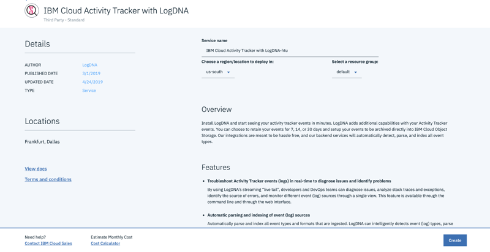

# Activity Tracker Lab

In this hands-on lab, you will learn how to gain visibility to your resources deployed on cloud. 

You will work with Activity Tracker and Activity Tracker with LogDNA to view cloud audit events. 

## What you need 

For completing this lab, you will need the following / complete these pre-requisites. 

1.	Laptop – install the IBM Cloud CLI, Install IBM Cloud Kubernetes Service plug-in  CLI ,
2.	Internet Connectivity 
3.	IBM Cloud Account – IBM Cloud 

```
Google Chrome or Firefox browser is recommended 
```

# Overview of Tasks

1.  Activity Tracker and  AT events
2.  Activity Tracker with LogDNA

# Activity Tracker

## Task 1 Create Activity Tracker Instance

The IBM Cloud Activity Tracker service records user-initiated activities that change the state of a service in the IBM Cloud.

1.	In the IBM Cloud catalog, select **Activity Tracker**.
2.	Give your service instance a name, or use the pre-set name.
3.	Click **Create**. 
4.	More details at this [link](https://cloud.ibm.com/catalog/services/activity-tracker)


## Task 2 Filter audit events for an user

1.	Go to the Activity Tracker Instance Dashboard
2.	Select Account logs in view logs

3.	Select **initiator.name_str**  in search attribute
4.	Input an IBM ID of the user in the account (for instance your email id) in the text field
5.	Press Filter
6.	You can see all the cloud API usage by that user


## TASK 3 - Filter audit events specific to a service

1.	Go to your Certificate Manager Instance
2.	Select a certificate and expand the entry to view the details.
3.	Switch back to the Activity Tracker Dashboard
4.	Select Account logs in view logs
5.	Select **target.name_str** in search attribute
6.	Input **“cloudcerts”** in the search field
7.	Press Filter
8.	You can see all the certificate manager API calls in Activity Tracker.


## TASK 4 - Filter audit events specific to an action

1.	Click on top navigation menu and click Manage
2.	Select Access (IAM)
3.	Select Service ID 


4.	Click Create


5.	Switch back to the Activity Tracker Dashboard
6.	Select Account logs in view logs
7.	Select action_str in search attribute
8.	Input “iam-identity.account-serviceid.create” in the search field
9.	Press Filter


## Activity Tracker Notes

•	All services declare the audit events that they send to Activity Tracker. For example, find below the [Security Advisor Events](https://cloud.ibm.com/docs/services/security-advisor?topic=security-advisor-at_events#monitor) 

•	As a security officer, auditor, or manager, you can use the IBM Cloud Activity Tracker service to track how users and applications interact with the IBM Cloud Identity and Access Management (IAM) service in IBM Cloud™. The events supported by Cloud IAM is available [here](https://cloud.ibm.com/docs/services/cloud-activity-tracker?topic=cloud-activity-tracker-at_events_iam)

•	The following table defines the Activity Tracker domain where you must monitor events:


•	You can view events through the Activity Tracker UI in the IBM Cloud console or through Kibana. If you have a premium plan, you can also see events through Kibana. You can launch Kibana from the Activity Tracker UI in the IBM Cloud, or directly from a web browser. Follow the instructions [here](https://cloud.ibm.com/docs/services/cloud-activity-tracker/how-to/manage-events-ui?topic=cloud-activity-tracker-launch_kibana#launch_Kibana_from_browser ) to open Kibana from Browser.


# Activity Tracker with LogDNA

1.	In the IBM Cloud catalog, select **Activity Tracker with LogDNA**.
2.	Give your service instance a name, or use the preset name.
3.	Click Create. 


4.	More details at this [link](https://cloud.ibm.com/observe/activitytracker/create ).


5.	Perform any certificate manager instance activities (like list, import, delete of certificates)
6.	Click on View LogDNA to get to the Dashboard
7.	See **cloudcerts** audit events


# References

* IBM Cloud Activity Tracker with LogDNA - [https://cloud.ibm.com/docs/services/Activity-Tracker-with-LogDNA?topic=logdnaat-getting-started#getting-started  ](https://cloud.ibm.com/docs/services/Activity-Tracker-with-LogDNA?topic=logdnaat-getting-started#getting-started)     

* IBM Cloud Activity Tracker - [https://cloud.ibm.com/docs/services/Activity-Tracker-with-LogDNA?topic=logdnaat-getting-started#getting-started  ](https://cloud.ibm.com/docs/services/cloud-activity-tracker?topic=cloud-activity-tracker-activity_tracker_ov)

