# App ID Lab

In this lab, we will be covering how to enable IBM App ID service for your application running in Kubernetes on IBM Cloud.

## Log into IBM Cloud

- Start by logging into IBM Cloud. Open <https://cloud.ibm.com/> in the browser and log in using your IBMid credentials.
- Select the account in which your kubernetes cluster is running by using the dropdown menu in the upper right-hand corner.
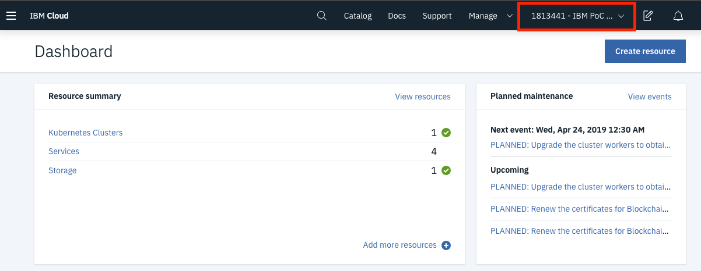

## Creating an App ID Service

Once logged into IBM Cloud, you will see your account's dashboard. This dashboard gives you an overview of everything associated with your account. Now lets walk through created a new App ID service.

- Find the **Create Resource** button at the top right of the dashboard and click it.

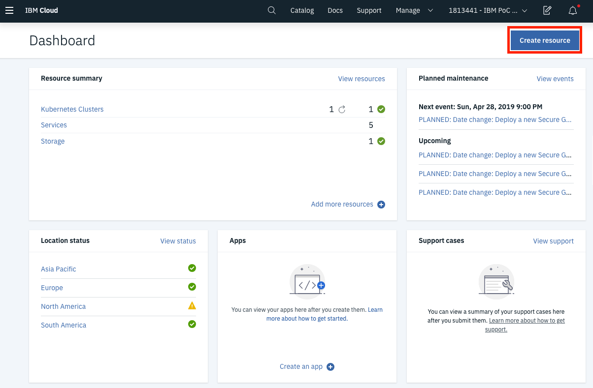

- In the search bar at the top of the screen, type in **App ID** and there should be an App ID tile that looks like the following:

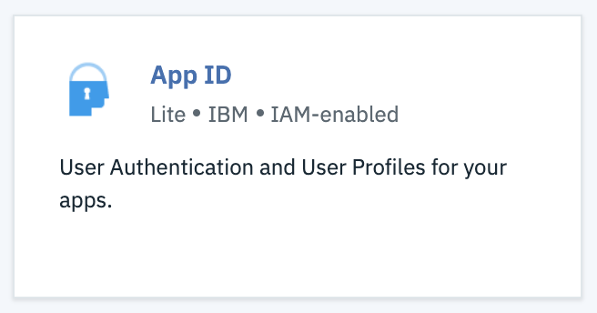

- Select that tile and the service dashboard will load. From this screen you can choose the service's region, resource group, and pricing plan. You can also create a unique name for your service. 

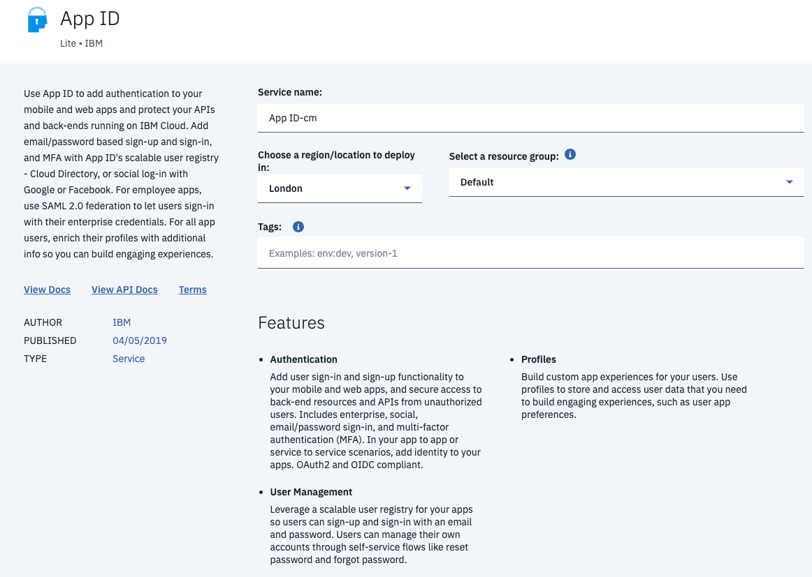

- After configuring the settings for the service, click the **Create** button at the bottom of the screen.  This will provision the new service and return you the services dashboard.

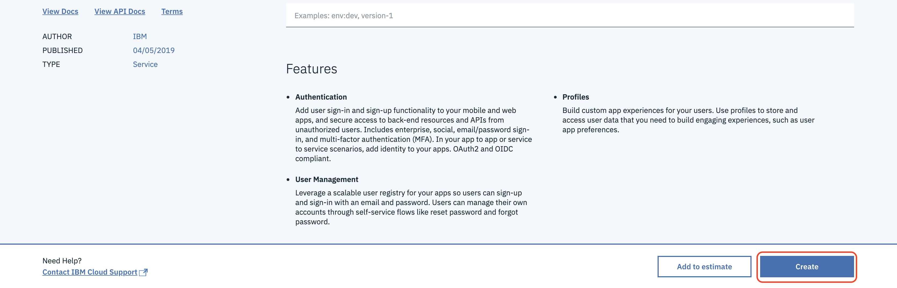

- That's it. Your new App ID service was created.
## Enabling your Application

## Cloud Directory Configuration

The Cloud Directory Configuration tab allows you to customize **settings**, **password policies**, and **workflow templates**.  It also allows you to enable **multi-factor authentication** and **single sign-on**.

#### Settings

- Go to **Cloud Directory -> Settings**. 
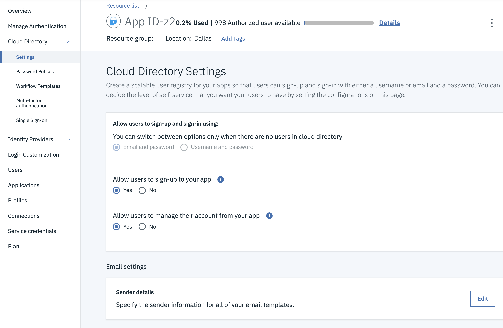

- We aren't going to change anything here, but as you can see you can switch the sign in, sign up, and account modification settings.

#### Password Policies (Advanced Password Graduated Tier Only)

- Go to **Cloud Directory -> Password Policies**. 
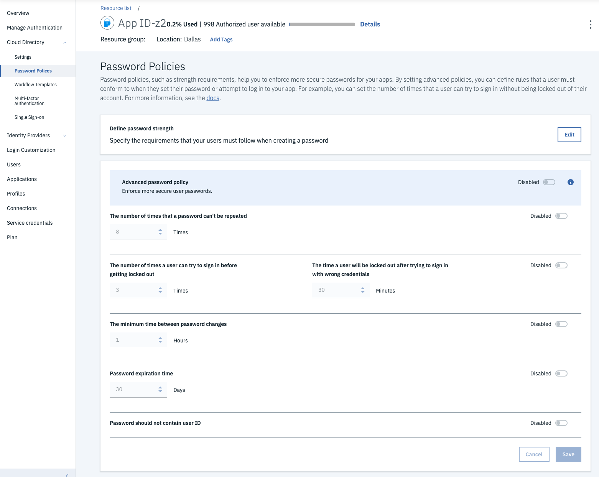

#### Workflow Templates

- Go to **Cloud Directory -> Workflow Templates**. 
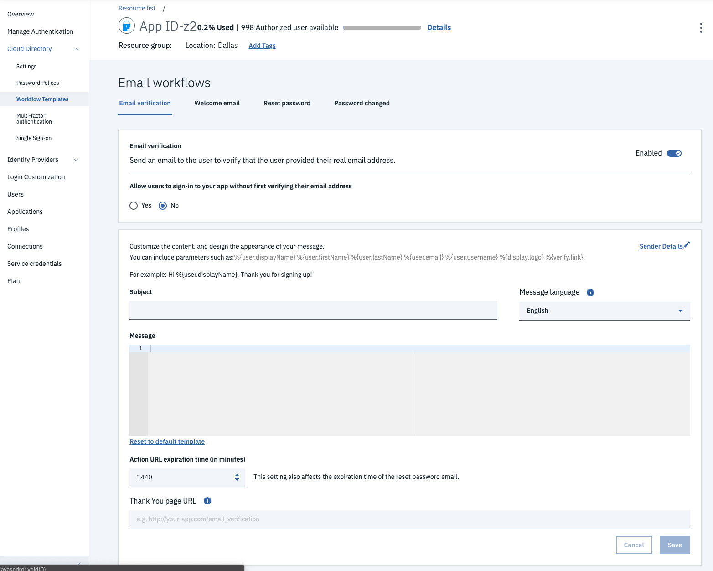

#### Multi-Factor Authentication (Graduated Tier Only)

- Go to **Cloud Directory -> Multi-Factor Authentication**. 
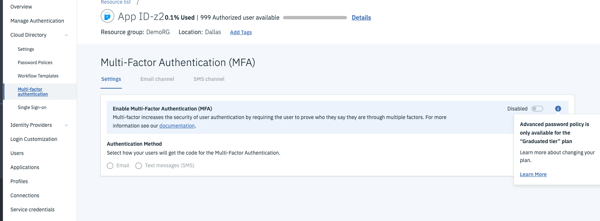

#### Single Sign-On (Graduated Tier Only)

- Go to **Cloud Directory -> Single Sign-On**. 
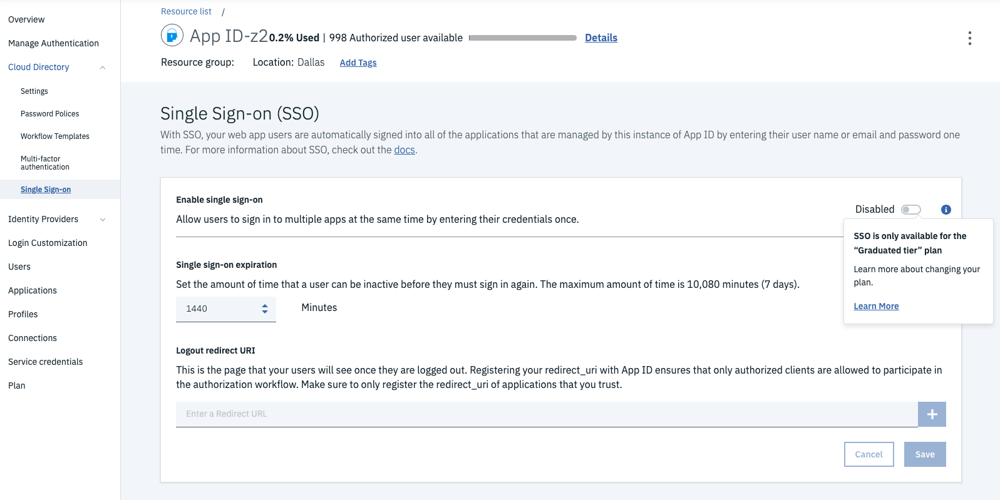

## User Management

The user management section allows you to **Add and Delete Users**. 

To get there click on the **Users** tab.

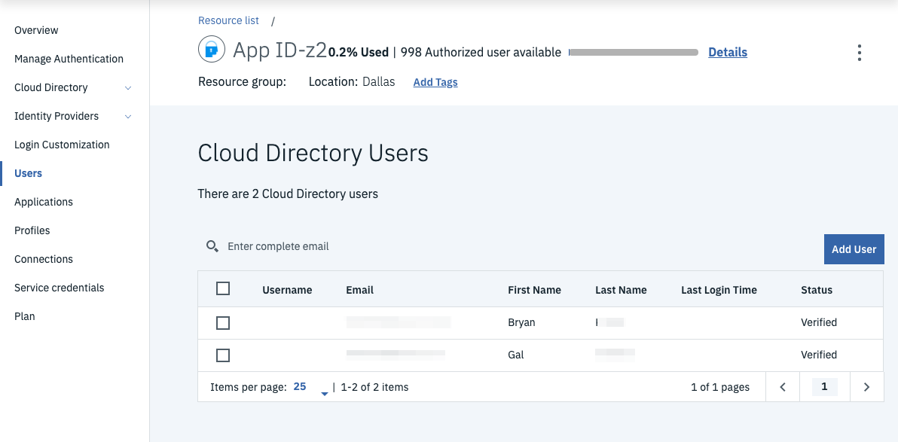

#### Adding a User  

- Click on **Add User** tab. 

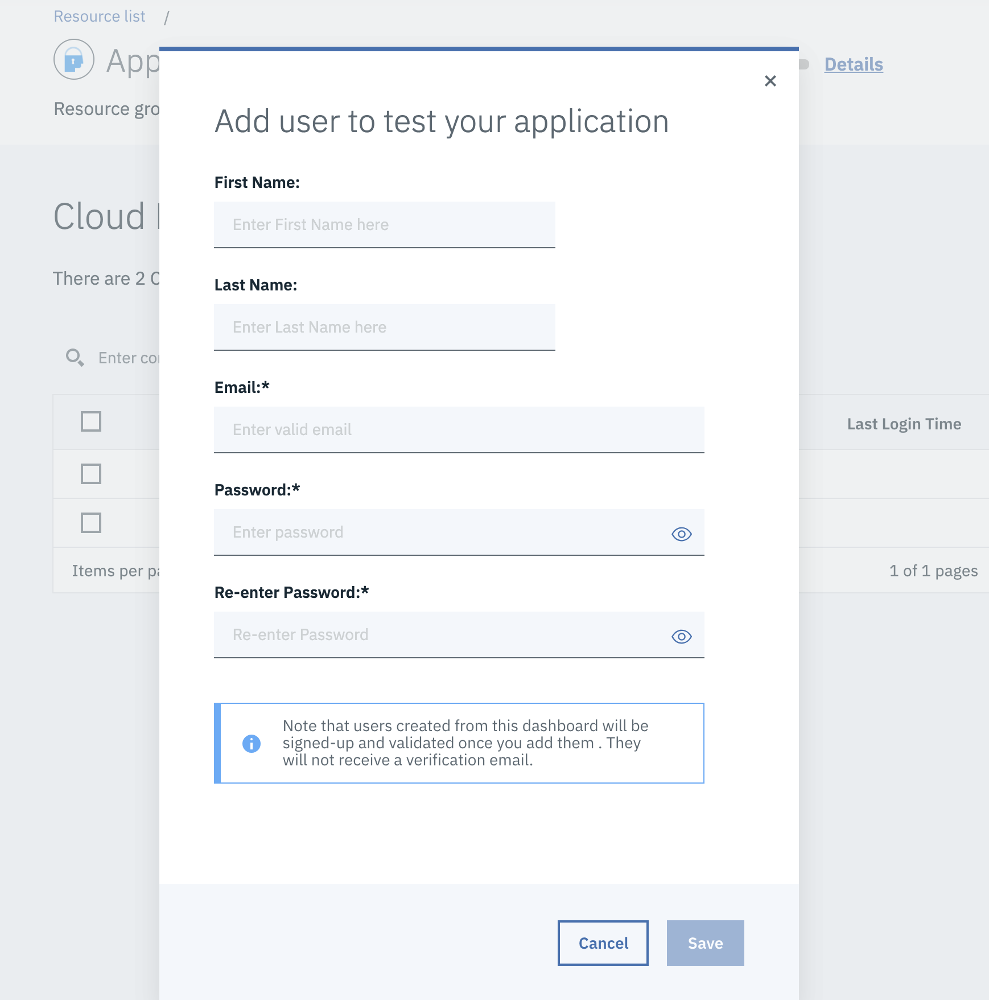

- Fill out the form that pops up and click **Save**.

#### Deleting a User  

- Select the checkbox next to the user you would like to delete.

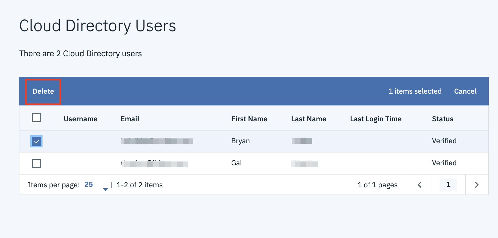

- Click the **Delete** button that appears.

## Login Customization

- Click on the **Login Customization** tab. 

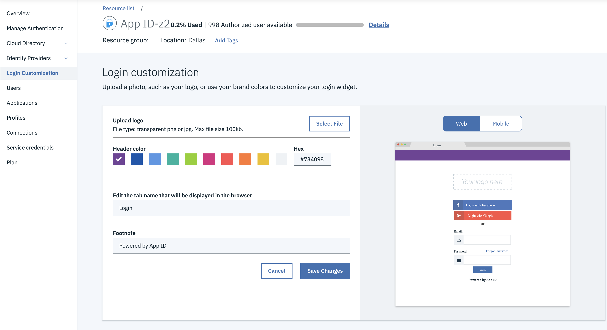

