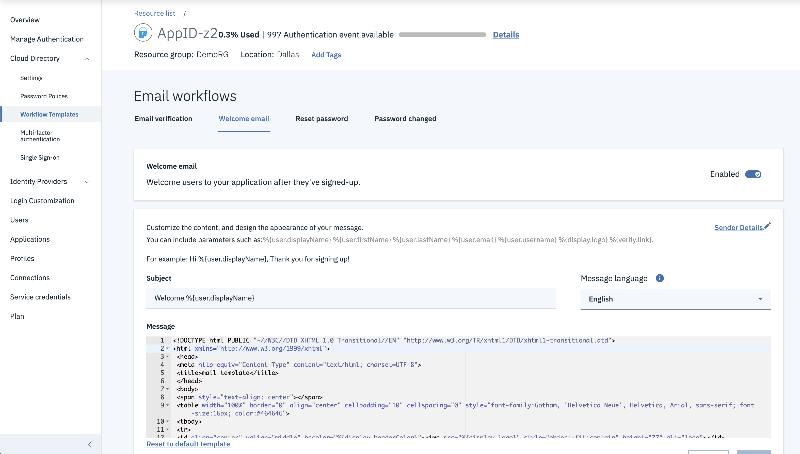

# App ID Lab
In this lab, we will be covering how to use IBM App ID service to customize your application running on Kubernetes.

## Accessing AppID Service

- Login to your IBM Cloud account and navigate to your account's **Services**.


- Next find your **AppID instance**.  It will have the following name convention **Team0(Your Team Number)RG-appid** 


- Click on your team's service and you will open the **AppID Overview Dashboard**.

## Cloud Directory Configuration

In the Cloud Directory Configuration tab we are going to customize the **Welcome Email** your users will recieve when they sign up for your website.

#### Welcome Templates

- Go to **Cloud Directory -> Workflow Templates -> Welcome Email**. 



- Next, **Replace** the subject line with the following:

``` 
Hello %{user.displayName}, Welcome to our site! 
```

## User Management

The user management section allows you to **Add and Delete Users**. 

- To get there click on the **Users** tab.


#### Adding a User  

- Let's add a User. Start by clicking on **Add User** tab. 

- **Fill out the form** with example user information and click **Save**.


- Now you can use that user information to sign in to your application.

## Login Customization

- Click on the **Login Customization** tab. 


- We are going to first change the logo. Download an example logo by clicking <a href="SampleLogo.png" download>Download Logo</a>.

- Next click on **Select File** and select the downloaded logo.


- Finally pick a **Header Color** of your choice and change the **Tab Name** and **Footer** to any text of your choice. Click **Save Changes**

