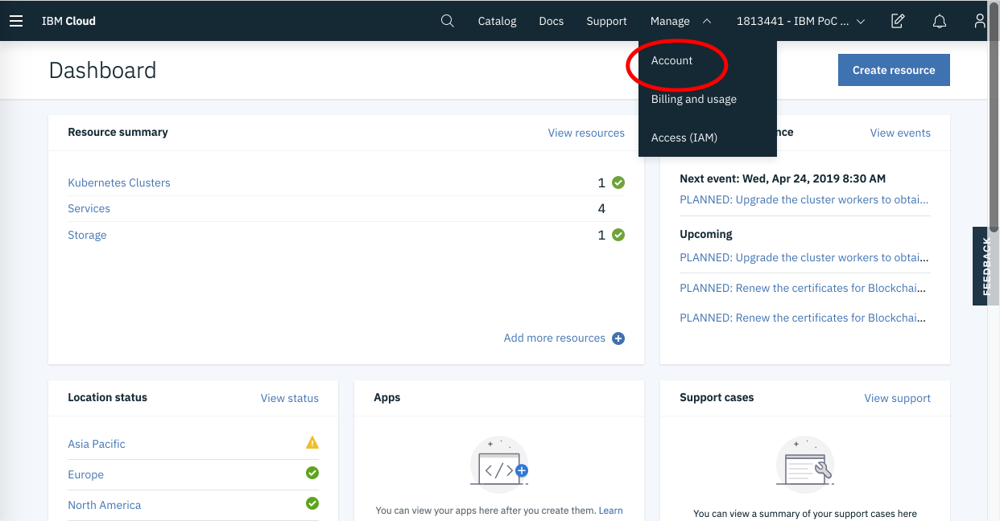
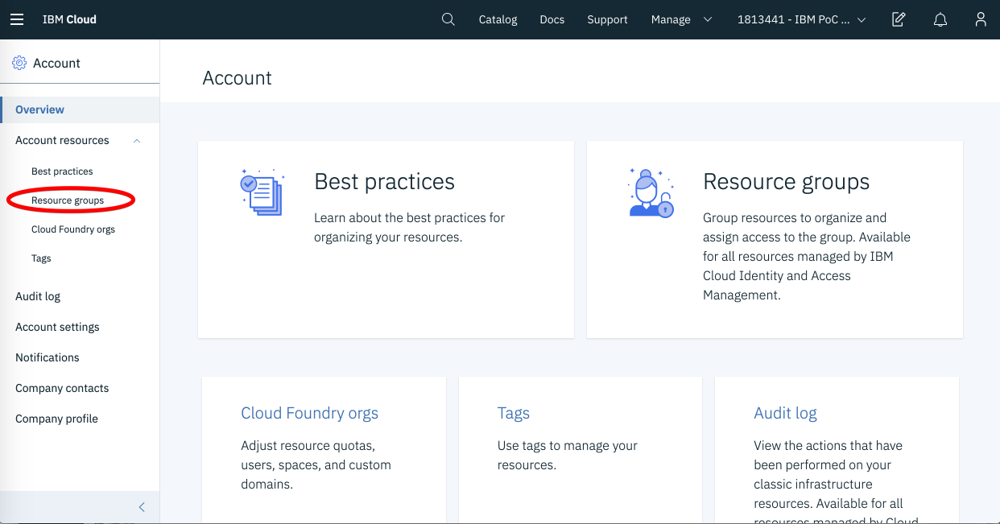
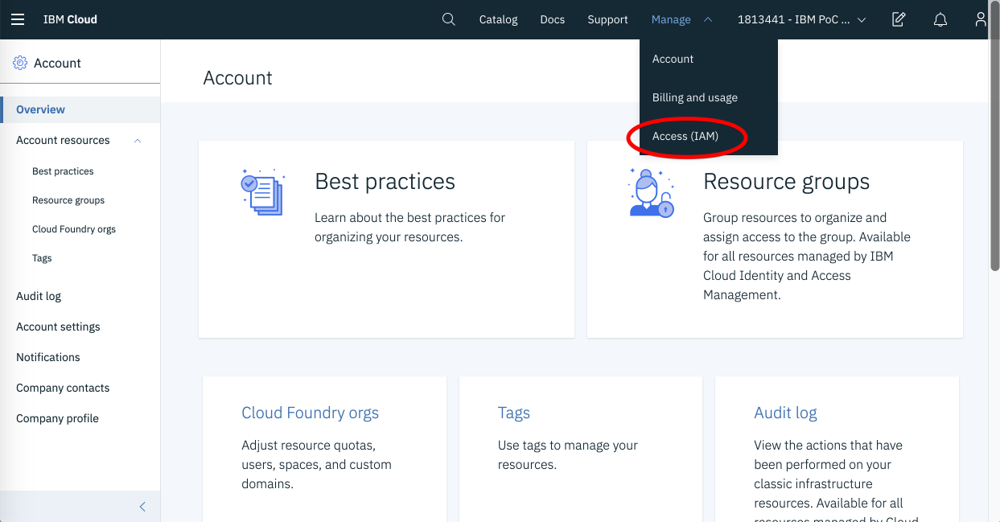
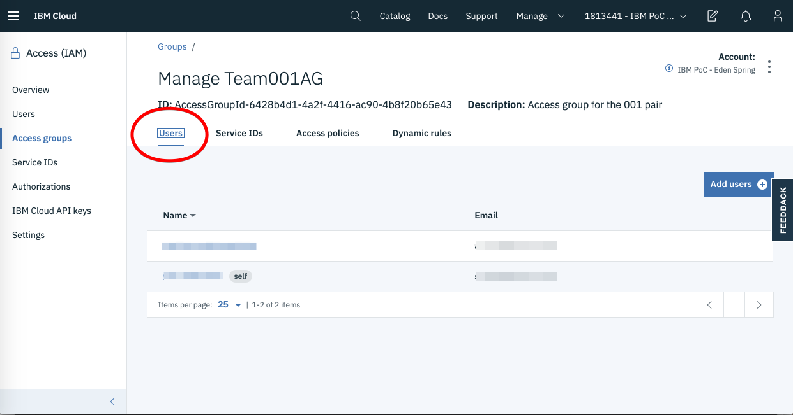
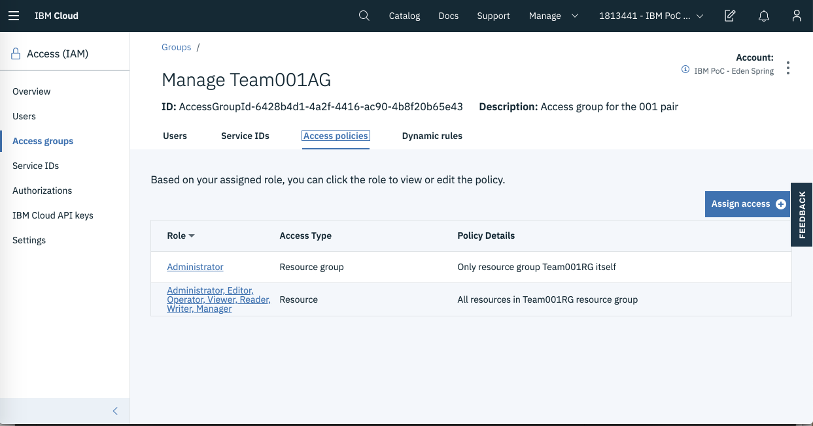
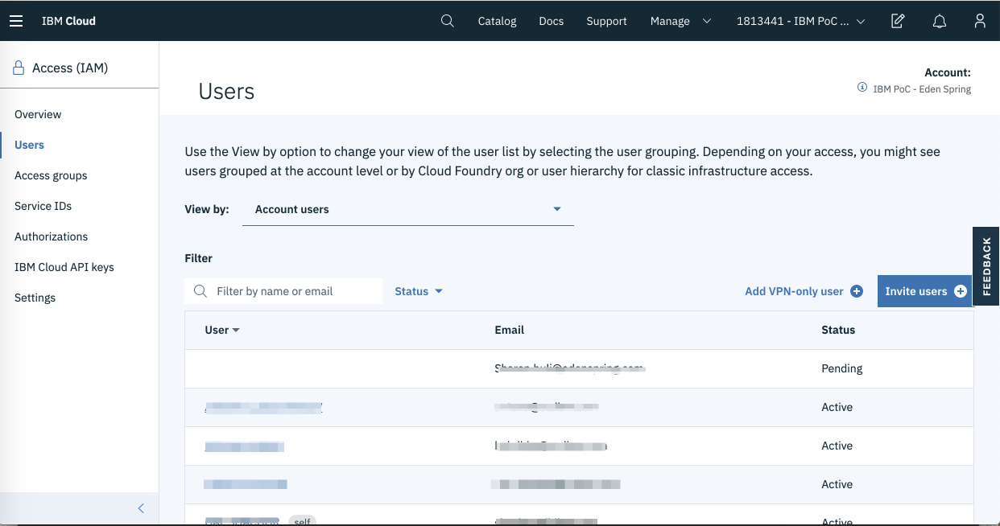
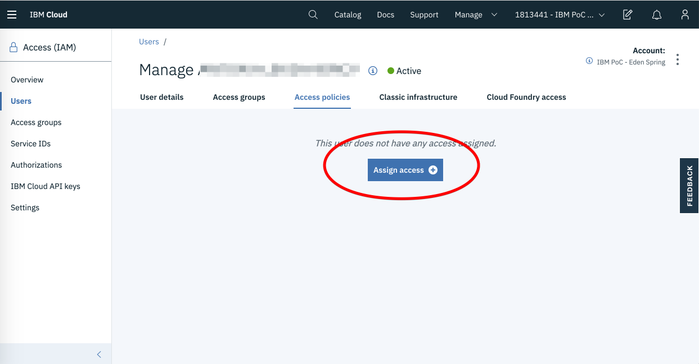
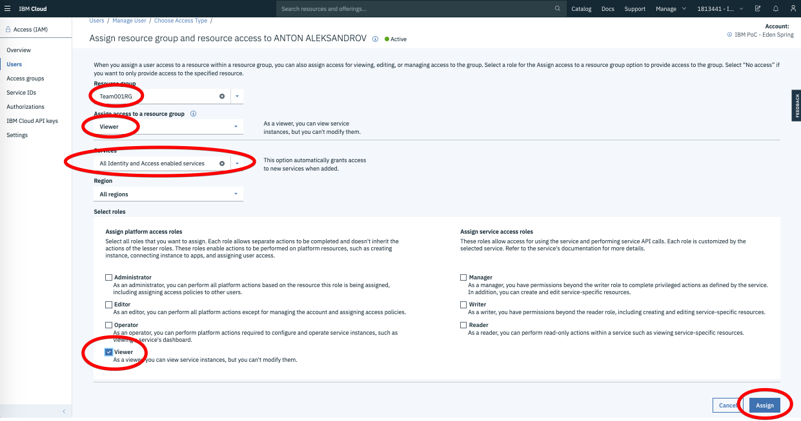
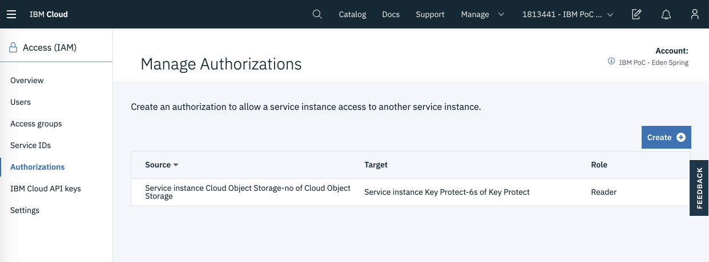
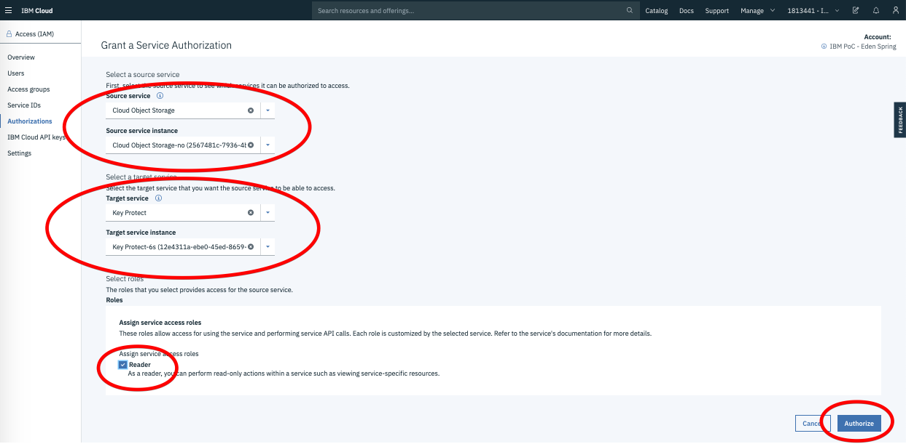

# Cloud IAM Lab

To accomplish this lab you will work in teams of two in the IBM Cloud Account dedicated to the workshop. 

## Log into IBM Cloud and review your permissions 

- Start by logging into IBM Cloud. Open <https://cloud.ibm.com/> in the browser and log in     using your IBMid credentials, then select the workshop account.
- Use the Manage menu bar and select the Account option to transition to the account UI as seen in  the following image 
- Click on the "Resource Groups" sidebar item and look at the list of your resource groups
  
- How is this list different from the one seen by an administrator? Why?
- Transition to the "Access (IAM)" UI using the Manage->Access (IAM) menu item per the 
  following image 
- Look at the list of Access Groups that you can access. Select the access group named 
  "TeamXXXAG", list its users and policies per the below images
    
    
- What access is this Access Group granting you?

Now that we established that you are an administrator for the access group and the services in it, lets make the following experiments

## Add a user as a Viewer to the access group and the services in it

- Transition to the "Access (IAM)" UI using the Manage->Access (IAM) menu item
- Look at the list of users by clicking the "Users" sidebar  you should see something similar to the below image 
- Select one of the users that's located near you and Add an access policy that grant the 
  user viewer access to your resource group and its services:
    - Open the user's "Access policies" tab and click "Assign access" as seen by the 
      following image 
    - Add a resource group access policy similar to the below 
    - Click "Assign"
- Validate that the user can now see the resource group and the services in it 

## Add an Authorization to a service in your resource group

We will now add a service authorization that authorizes Object Storage to access the KeyProtect Service. This access is required to support customer managed encryption of storage buckets.

At the end of this step, the list of authorizations will include an authorization similar to the one listed in the image below 

To add the authorization, perform the following steps:

- Transition to the "Access (IAM)" UI using the Manage->Access (IAM) menu item
- Select the Autorizations side menu and click the "Create" button
- Enter the following details into the access policy:
    - Source service - "Cloud Object Storage"
    - Source service instance - the COS instance in your resource group
    - Target service - Key Protect 
    - Target service instance - the Key Protect instance in your resource group
    - Reader role

- Click "Authorize" 

You have just added an authorization from Object Storage to Key Protect. 