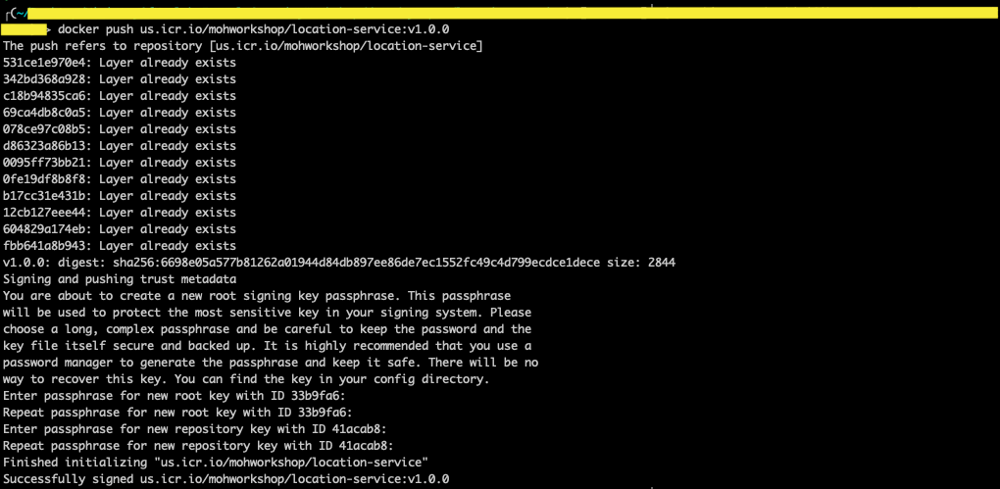
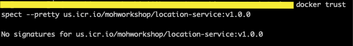

## Image Signing - Docker Notary

IBM cloud container registry provides you with trusted content technology. It allows you to sign images in  your registry namespace to ensure the integrity. Signed images will help you to verify that they are pushed by the right party.

Docker Content Trust uses a "trust on first use" security model. In this model, the repository key will be pulled from the trust server when we first pull the signed imaged from the repository. If your trusted server is compromised by the time you pull your first image, then it may pull the compromised information from the trust server. Otherwise, your docker client will not pull the image due to its failure to verify the compromised data.

1. Enable Docker content trust environment variable.

`export DOCKER_CONTENT_TRUST=1`

2. Login to your IBM Cloud CLI.

`ibmcloud login`

For federated id, use `ibmcloud login --sso`

3. Choose the region to target.

`ibmcloud cr region-set`

4. Log in to your IBM Cloud Container Registry.

`ibmcloud cr login`

5. Copy the environment variable and enable it.

`export DOCKER_CONTENT_TRUST_SERVER=https://us.icr.io:4443`

6. Now, you can push the signed image using below command.

`docker push <region>.icr.io/<namespace>/<image_repository>:<tag>`

7. Similarly, you can pull the image as follows.

`docker pull <source_image>:<tag>`

8. To view the signed images, you can run the below command.

`docker trust inspect --pretty <image>:<tag>`

9. You can also revoke the trusted content status of the image.

`docker trust revoke <image>:<tag>`

10. Verify it the trust was revoked.

`docker trust inspect --pretty <image>:<tag>`  

11. Make sure you back up your keys. When you first push your image to the repository, the root key and repository key will be stored in `docker/trust/private`. If the keys are lost, the [recovery options](https://cloud.ibm.com/docs/services/Registry?topic=registry-ts_index#ts_recoveringtrustedcontent) are limited. You can get more information on how to back up your keys [here](https://docs.docker.com/engine/security/trust/trust_key_mng/#back-up-your-keys).

12. You can also add and remove signers from signing images in the repository.

 **1. Adding signer to trust store**

      - Generate a key pair and load it.

      `docker trust key generate <NAME>`

      

      Here, a public key (.pub) is generated, and the corresponding private key is automatically loaded into the Docker trust configuration.

      - Add the signer's key to the repository.

      `docker trust signer add --key <NAME>.pub <NAME> <repository>`

      

      - The signer must sign an image. Enter the passphrase for the private key when prompted.

      `docker trust sign <repository>:<tag>`

      

 **2. Removing the signer**

       - To remove the signer, run the below command.

       `docker trust signer remove <NAME> <repository>`

       
