## Image Security deployment enforcement controls

The enforcement controls for image security deployment helps you to verify the images before deploying them to the IBM Cloud Kubernetes service.
Using this, you can define vulnerability advisor policies and also ensure that content trust is properly applied to the image. If the requirements are not met, the pod will not be deployed.

### Configuring your CLI to run kubectl

1. Login to IBM Cloud CLI.

`ibmcloud login`

If using federated id, use `ibmcloud login --sso`

2. Choose your account and select the organization where the cluster resides.

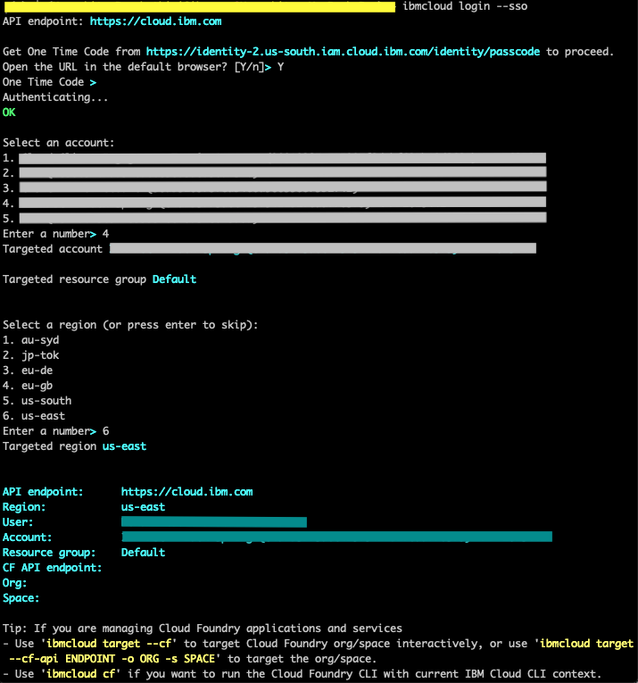

3. Target the resource group.

`ibmcloud target -g <resource_group> -r <region>`

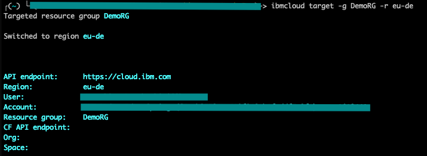

4. Target the region.

`ibmcloud ks region-set <region>`

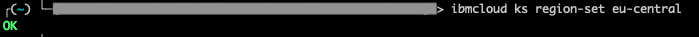

5. Set the context for the cluster.

`ibmcloud ks cluster-config <your_cluster_name>`

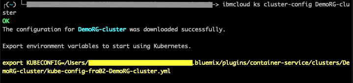

6. Export the KUBECONFIG environment variable from the previous step.

`export KUBECONFIG=/Users/<users-name>/.bluemix/plugins/container-service/clusters/DemoRG-cluster/kube-config-fra02-DemoRG-cluster.yml`

### Setting Up Helm

1. You need Helm CLI on your local machine. If not installed, follow the instructions [here](https://helm.sh/docs/using_helm/#installing-helm).

2. Check if tiller is installed in your cluster.

`kubectl get serviceaccount --all-namespaces | grep tiller`

If it is installed, you will see something like below.

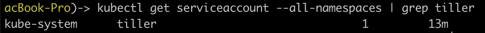

3. If tiller is installed, do the below.

Create a cluster role binding.

`kubectl create clusterrolebinding tiller --clusterrole=cluster-admin --serviceaccount=<namespace>:tiller -n <namespace>`

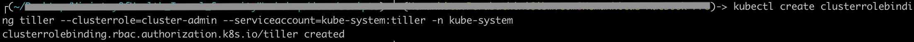

Update tiller.

`helm init --upgrade --service-account <tiller_service_account_name>`

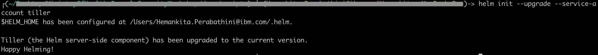

Verify tiller status.

`kubectl get pods -n <namespace> -l app=helm`

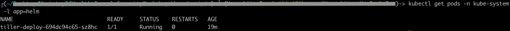

4. If tiller is not installed, do the below.

Create a Kubernetes service account and cluster role binding for Tiller in the kube-system namespace.

```
kubectl create serviceaccount tiller -n kube-system
kubectl create clusterrolebinding tiller --clusterrole=cluster-admin --serviceaccount=kube-system:tiller -n kube-system
```

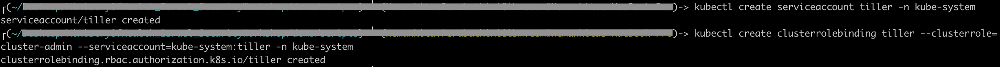

Verify if it is created.

`kubectl get serviceaccount -n kube-system tiller`

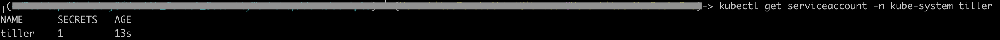

Initialize helm CLI and install tiller.

`helm init --service-account tiller`

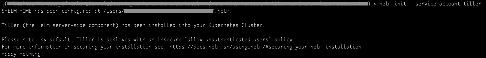

Verify the status.

`kubectl get pods -n kube-system -l app=helm`

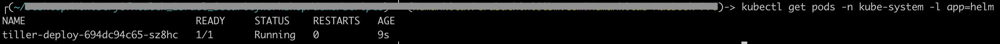

### Installing Container Image Security Enforcement

Install the IBM Container image security enforcement using the helm chart from the IBM chart repository.

Add the ibm repo.
```
helm repo add ibm https://icr.io/helm/ibm
```

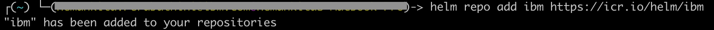

```
helm install --name cise ibm/ibmcloud-image-enforcement
```

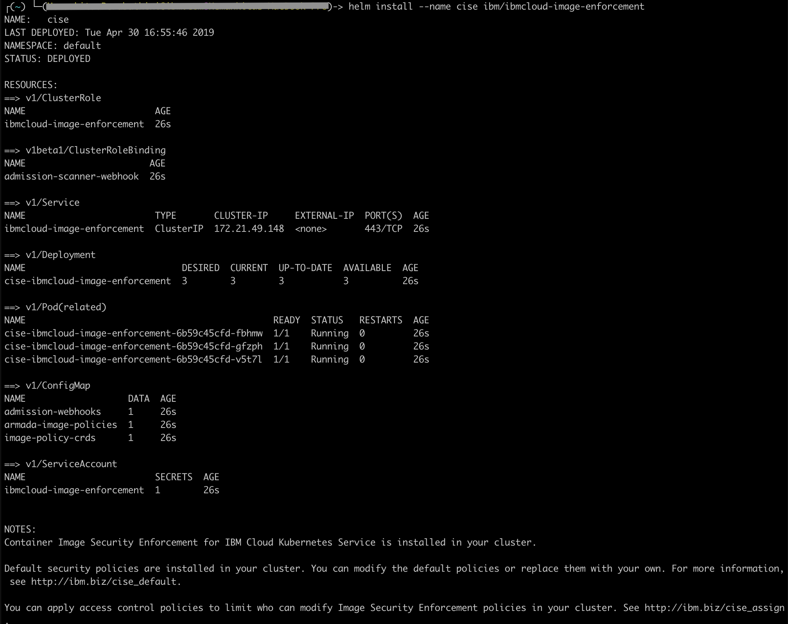

With this you get some default policies.

### Default policies

1. To get the cluster wide policy, run

`kubectl get clusterimagepolicy`

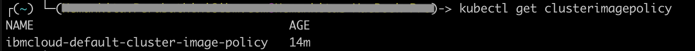

To get the description, run

`kubectl describe clusterimagepolicy ibmcloud-default-cluster-image-policy`

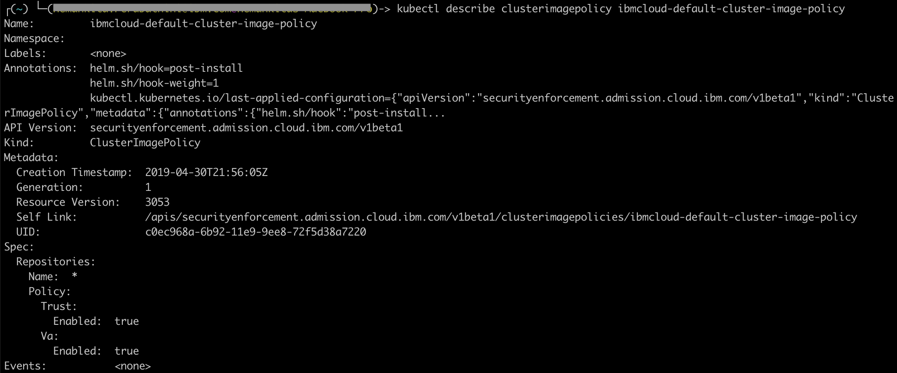

2. To get the kube system policy, run

`kubectl get imagepolicy -n kube-system`

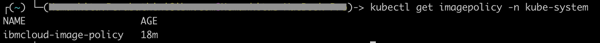

To get the description, run

`kubectl describe imagepolicy ibmcloud-image-policy -n kube-system`


3. To get the IBM system policy, run

`kubectl get imagepolicy -n ibm-system`

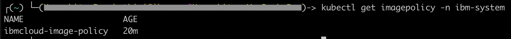

To get the description, run

`kubectl describe imagepolicy ibmcloud-image-policy -n ibm-system`

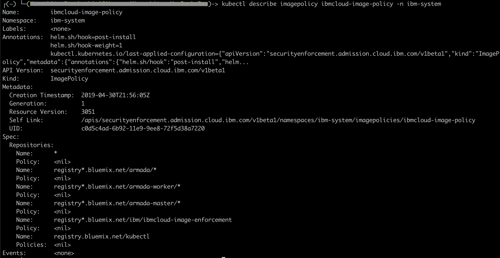

### Customize the policies.

1. To override the existing policies, we can do the following.

- Write a new policy document and apply it to the cluster by using `kubectl apply` or
- Edit the default policy by using `kubectl edit`

2. Let us now edit the `ibmcloud-default-cluster-image-policy`.

`kubectl edit ClusterImagePolicy ibmcloud-default-cluster-image-policy`

You will see something like below.

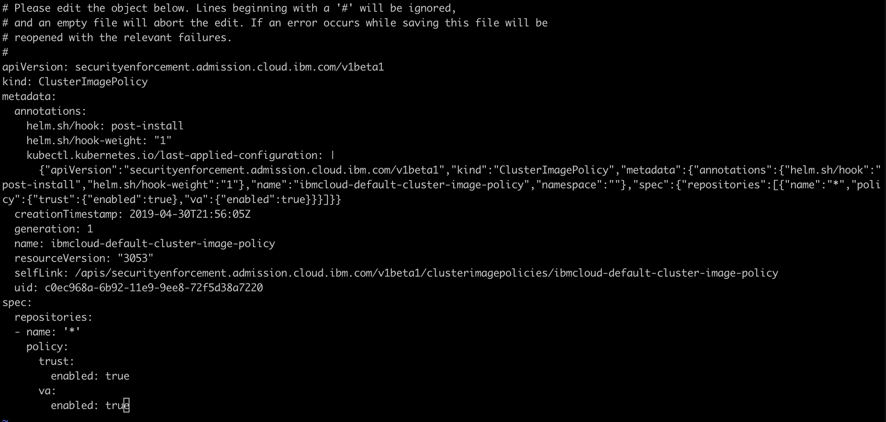

Change the repository name from `*` to `docker.io` and save it.

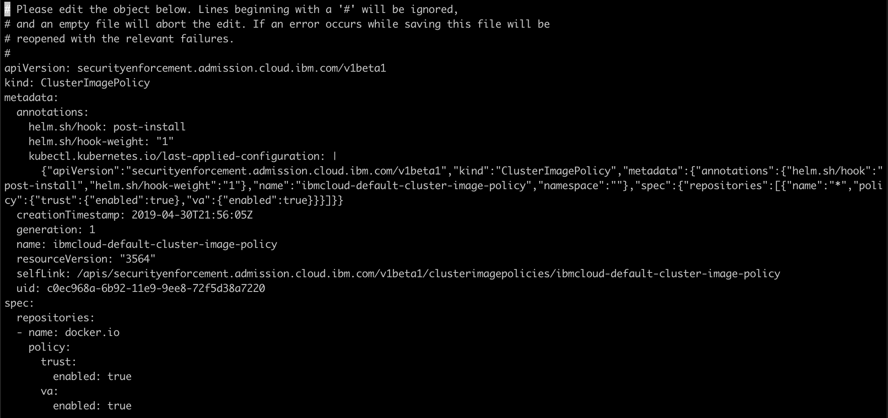

Once it gets edited, the changes will apply.

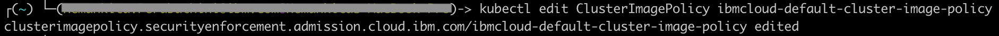

Here, previously our cluster image policy allows to use the images from any repository where as now we restricted it to only use the images from `docker.io`. In this way, you can define your own policies based on the requirements.

3. If you want to create a complete ClusterImagePolicy, create a kubernetes custom resource definition like below.

```
apiVersion: securityenforcement.admission.cloud.ibm.com/v1beta1
kind: <ClusterImagePolicy_or_ImagePolicy>
metadata:
  name: <crd_name>
spec:
   repositories:
    - name: <repository_name>
      policy:
        trust:
          enabled: <true_or_false>
          signerSecrets:
          - name: <secret_name>
        va:
          enabled: <true_or_false>
```

and then do `kubectl apply -f <your_file>`
