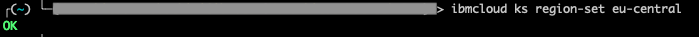
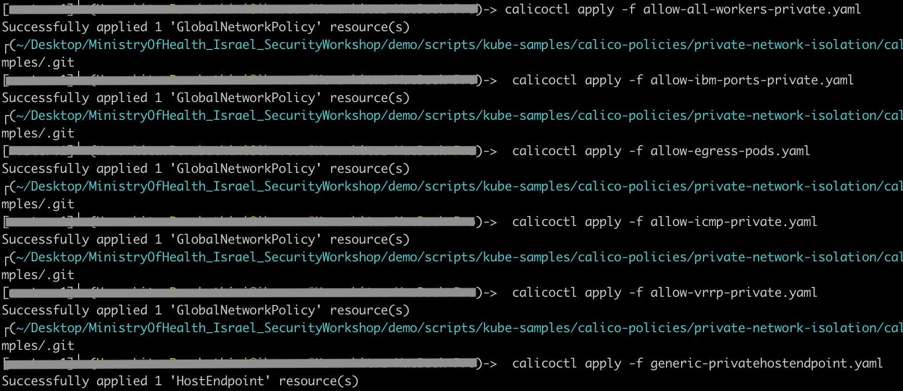

## Network Security

On IBM Cloud Kubernetes Service, you can control the traffic with network policies. Every Kubernetes cluster on IBM Cloud is set up with a network plug-in called Calico which provides default network policies to secure public network interfaces.

You can use kubernetes and Calico network policies to set any additional security requirements on your cluster. To know more, access [Kubernetes network policies](https://kubernetes.io/docs/concepts/services-networking/network-policies/) and [Calico network policies](https://docs.projectcalico.org/v3.3/getting-started/bare-metal/policy/) for additional information.

For each worker node and its public interface, `ibm.role: worker_public` label is created automatically whenever a cluster with a public VLAN is created. In order to protect them, default Calico policies are applied with the `ibm.role: worker_public` label to any host endpoint.

The below are the default Calico policies for the cluster.

| Policy | What it does |
| ---- | --- |
| allow-all-outbound | Allows all outbound traffic. |
| allow-bigfix-port | Allows incoming traffic on port 52311 to the BigFix app to allow necessary worker node updates. |
| allow-icmp | Allows incoming ICMP packets (pings). |
| allow-node-port-dnat | Allows incoming network load balancer (NLB), Ingress application load balancer (ALB), and NodePort service traffic to the pods that those services are exposing. |
| allow-sys-mgmt | Allows incoming connections for specific IBM Cloud infrastructure (SoftLayer) systems that are used to manage the worker nodes. |
| allow-vrrp | Allow VRRP packets, which are used to monitor and move virtual IP addresses between worker nodes. |

### Configuring your CLI to run kubectl

1. Login to IBM Cloud CLI.

`ibmcloud login`

If using federated id, use `ibmcloud login --sso`

2. Choose your account and select the organization where the cluster resides.


3. Target the resource group.


4. Target the region.



5. Now set the context for your cluster using the below command.

`ibmcloud ks cluster-config --cluster <cluster_name_or_ID> --admin --network`


Export the environment variable from the previous step.

### Setting up Calico

1. Initially, do the below steps.

```
sudo mkdir /etc/calico
sudo mv /Users/<user>/.bluemix/plugins/container-service/clusters/<cluster_name>-admin/calicoctl.cfg /etc/calico
```
2. Download the Calico CLI [here](https://github.com/projectcalico/calicoctl/releases).

**Note**: If you are using OS X, download the -darwin-amd64 version. If you are using Windows, install the Calico CLI in the same directory as the IBM Cloud CLI. This setup saves you some file path changes when you run commands later. Make sure to save the file as `calicoctl.exe`.

3. Move the executable file to the /usr/local/bin directory.

For instance, on OS X `mv <location_dir>/calicoctl-darwin-amd64 /usr/local/bin/calicoctl`

4. Make the file an executable file.

`chmod +x /usr/local/bin/calicoctl`

5. Verify if it works properly.

`calicoctl get nodes`


**Note**: For windows, append `--config=filepath/calicoctl.cfg` for all the calicoctl commands. For example, `calicoctl get nodes --config=filepath/calicoctl.cfg`

6. View the calico host endpoint.

`calicoctl get hostendpoint -o yaml`


7. View all calico and kubernetes network policies.

`calicoctl get NetworkPolicy --all-namespaces -o wide`

`calicoctl get GlobalNetworkPolicy -o wide`


8. View the network policy details.

`calicoctl get NetworkPolicy -o yaml <policy_name> --namespace <policy_namespace>`


9. View global network policies details.

` calicoctl get GlobalNetworkPolicy -o yaml`


10. In order to apply any custom policies, you can use the below command.

`calicoctl apply -f policy.yaml`

Let us create some policies and apply them to the cluster.

### Controlling inbound traffic

#### Create a Pre-DNAT policy

For example, if you want to block all node ports, create the below resource.

**deny-nodeports.yaml**

```
apiVersion: projectcalico.org/v3
kind: GlobalNetworkPolicy
metadata:
  name: deny-nodeports
spec:
  applyOnForward: true
  preDNAT: true
  ingress:
  - action: Deny
    destination:
      ports:
      - 30000:32767
    protocol: TCP
    source: {}
  - action: Deny
    destination:
      ports:
      - 30000:32767
    protocol: UDP
    source: {}
  selector: ibm.role=='worker_public'
  order: 1100
  types:
  - Ingress
```
To apply the policy, run the below command.

`calicoctl apply -f deny-nodeports.yaml`


#### Isolate your cluster on private network.

1. Clone the below repository.

` git clone https://github.com/IBM-Cloud/kube-samples.git`

2. Navigate to below path.

`cd kube-samples/calico-policies/private-network-isolation/calico-v3`

3. Open the `generic-privatehostendpoint.yaml` policy.

4. Replace `<worker_name>` with the name of a worker node.

You can get the name using the below command.

`calicoctl get nodes --config=filepath/calicoctl.cfg`


5. Replace `<worker-node-private-ip>` with the private IP address for the worker node. To see your worker nodes' private IPs, run the below command.

`ibmcloud ks workers --cluster <my_cluster>`.


6. Repeat this set of steps in a new section for each worker node in your cluster.

**Note**: Each time you add a worker node to a cluster, you must update the host endpoints file with the new entries.

7. Now, apply the policies to your cluster.

```
calicoctl apply -f allow-all-workers-private.yaml
calicoctl apply -f allow-ibm-ports-private.yaml
calicoctl apply -f allow-egress-pods.yaml
calicoctl apply -f allow-icmp-private.yaml
calicoctl apply -f allow-vrrp-private.yaml
calicoctl apply -f generic-privatehostendpoint.yaml
```



These are some examples of policies you can apply. Using Calico, additionally you can also control traffic between pods. You can isolate app services within a namespace or in between them too. You can also do things like creating Calico log network policy etc based on your security requirements.
