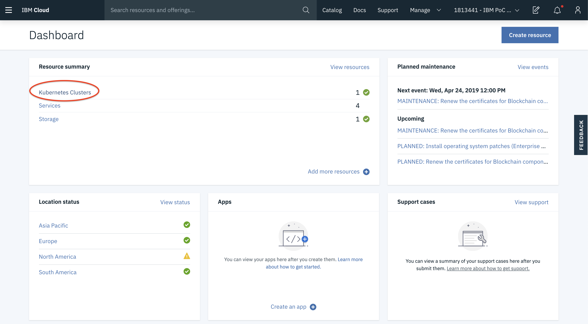

# IKS Security Lab

## Container Registry

IBM Cloud Container Registry helps you to store your docker images. These images can be either accessible by the public using public registry or the access can be restricted to certain users using private registry. Also, this registry allows only the IBM Cloud account users to access the images.

* Multi-tenant
* Highly available
* Scalable
------

- Login to your IBM Cloud Account and access the **Kubernetes Clusters** in your lab account.

- Access your **Team's Cluster (TeamXXXRG)** under the Kubernetes Clusters.

- If you click on the **Access** tab, it will give you the instructions to access the cluster in your command line. You can give it a try if you are interested.

- Scroll down to the bottom and you will find an option **creating a registry!** which takes you to the IBM Container Registry. If there is an existing registry, it takes you there or else it will create one for you.

- The **Quick Start** will give you instructions on how you can push your images to the registry.

We already pushed some of the images from our demo application.

- If you click on the **Namespaces**, you can see the existing namespaces in our registry.

- Let us now access **Repositories** and see what are existing in our registry.

- You can also see all the available images by clicking on **Images**.

## Vulnerability Advisor

Vulnerability Advisor scans the security status of the docker images that are pushed to the registry namespace. When the image is added to the namespace, it will be scanned automatically by the vulnerability advisor to detect the security issues and potential vulnerabilities.

It will generate a report suggesting the fixes. You can also add exemptions based on your requirements. Fixing the issues that are reported can help you to secure your IBM Cloud infrastructure.

- If you click on the **Images**, you can see `Security Status` associated with each image.

- Let us now click on one of the issues and see what it shows us. For instance, click on the security issue for location service.

- You can now see various issues of the image here.

- Click on any of the issues to expand. You can see the reason for your issue and it also suggests you a fix.

- If you know your issue can be an exemption, you can create one.

- You can then create a policy exemption and save it.

- The issue will be exempted and you can see it.

- Alternatively, you can also access vulnerability advisor and create exemption policies there as well.

You can go to your Kubernetes cluster and access **vulnerability advisor** similar to the Registry.

- Click on the **Policy Settings** under Vulnerability Advisor and you can create an exemption for your issue using **Create Exemption**.

- Find the `Issue ID` for your issue and add it in the **Issue ID** field. Then **Save** the policy.

Here, let us get the issue id of the vulnerability for the location service which is `CVE-2019-5953` and you can see it in the above steps.

- Once you create the exemption, go back to your issue. Since we added the exemption, and there are no more issues it shows **OK to Deploy**.

## Protecting Sensitive information

Sometimes, you may have sensitive data on your cluster. This may be at application level or cluster level.

At cluster level, all the configuration data will be stored in the etcd component which in turn will be saved on local disk of kubernetes master.

At application level, all the confidential information such as usr names, passwords etc. are stored as Kubernetes secrets.

Inorder to protect the etcd data on the local disk of your kubernetes master and also the kubernetes secrets, you can enable IBM Key Protect encryption.

Below are some other security features. We are not walking through them today in this lab, but you can give them a try if you are interested.

- [Image Signing - Docker Notary](./ImageSigning.md)
- [Image Security deployment enforcement controls](./ImgSecurityEnforcement.md)
- [Network Security](./NetworkSecurity.md)
