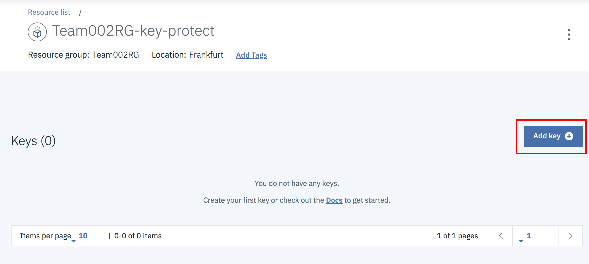
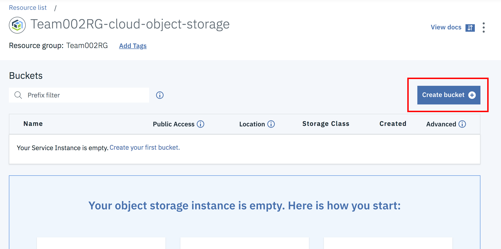
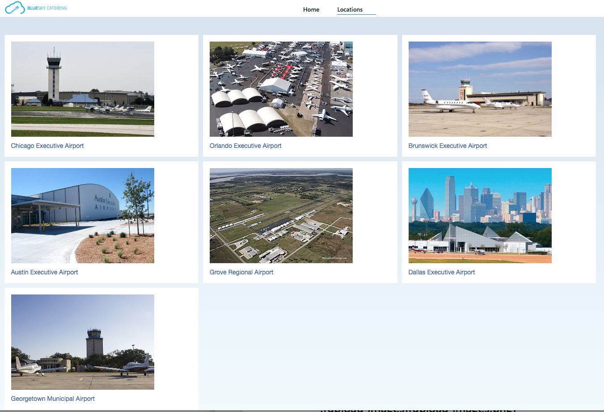

# Key Protect Lab
In this lab you will be enabling the Key Protect service with Cloud Object Storage.

## Create New Key Protect Key

From the Dashboard, select ‘View resources’

Then, select the Key Protect instance

Select ‘Add key’ to create a new key

Create new key with the type ‘Root key’ and a unique name (write this down). Then, click ‘Create key’.

## Select Cloud Object Storage instance

From the Dashboard, select ‘View resources’

Select your Cloud Object Storage instance

Click the ‘Create bucket’ link

Fill out the following settings:
- Bucket name (!!!must be identical to cloud-security-workshop-teamXXXrg-bucket-20190506 - where XXX is your team number!!!)
- Location (must be equal to the region of your Key Protect Service – eu-de)
- Check ‘Add Key Protect Keys’
- Select your Key Protect Service Instance and Key Name from the first section
Then, click ‘Create bucket’

Then, upload all of your images

Check that your application instance is able to retrieve the images. https://app.teamXXXrg-cluster.eu-de.containers.appdomain.cloud - where XXX is your team number.

