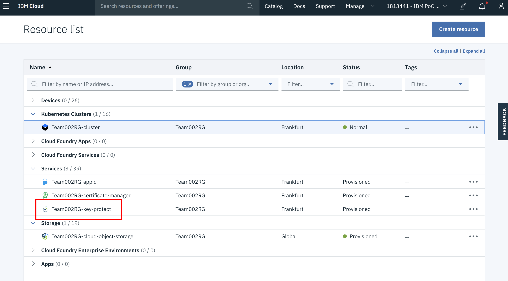
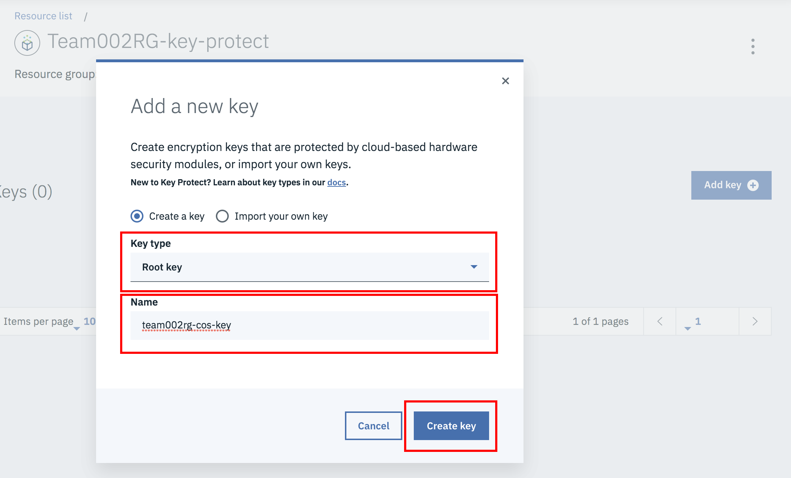
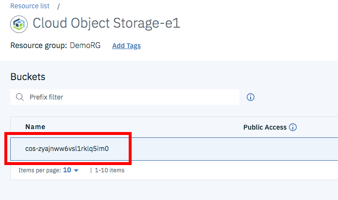

# Key Protect Lab
In this lab you will be enabling the Key Protect service with Cloud Object Storage.

## Log into IBM Cloud

- Start by logging into IBM Cloud. Open <https://cloud.ibm.com/> in the browser and log in using your IBMid credentials.
- Select the account in which your Kubernetes cluster is running by using the dropdown menu in the upper right-hand corner.

## Create New Key Protect Key

From the Dashboard, select ‘View resources’

Then, select the Key Protect instance

Select ‘Add key’ to create a new key

Create new key with the type ‘Root key’ and a unique name (write this down). Then, click ‘Create key’.

## Delete Existing Storage Bucket

From the Dashboard, select ‘View resources’

Select your Key Protect Instance

Click on your bucket

Download all of the images (x7) in the bucket to your local machine.

Delete the objects from the bucket

Write down the name of the bucket, then delete the bucket

Check that your application instance no longer retrieves the images. (Should show blank – may have to clear cache).

## Create New Storage Bucket with Key Protect
cos-zyajnww6vsl1rklq5im0

On the page of the Cloud Object Storage instance, click the ‘Create bucket’ link

Fill out the following settings:
- Bucket name (must be identical to bucket that was just deleted)
- Location (must be equal to the region of your Key Protect Service – eu-de)
- Check ‘Add Key Protect Keys’
- Select your Key Protect Service Instance and Key Name from the first section
Then, click ‘Create bucket’
NOTE: You may have to wait some time for the name to be available again.

Then, upload all of your images

Check that your application instance is able to retrieve the images again.

