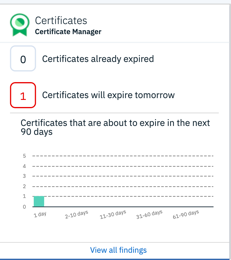
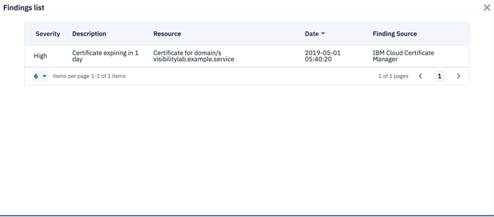
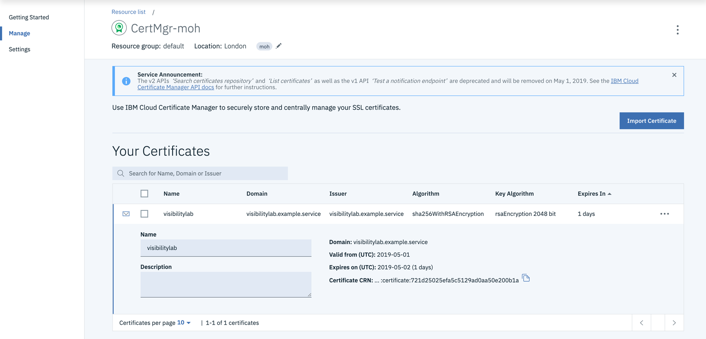
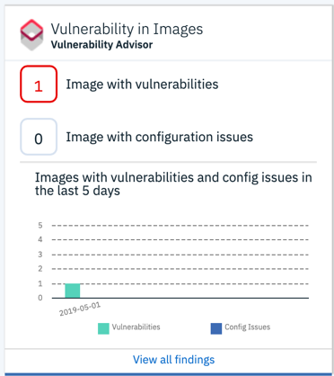
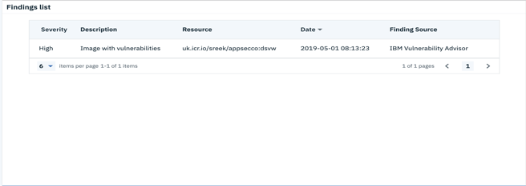
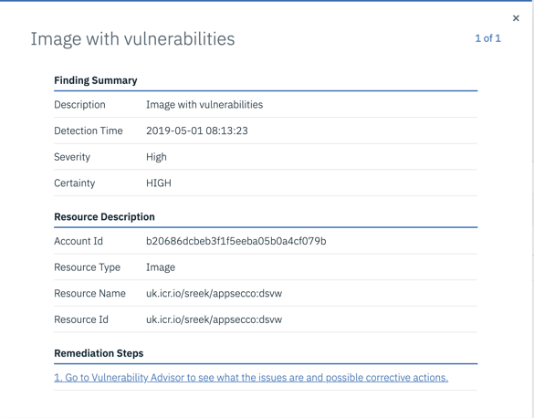
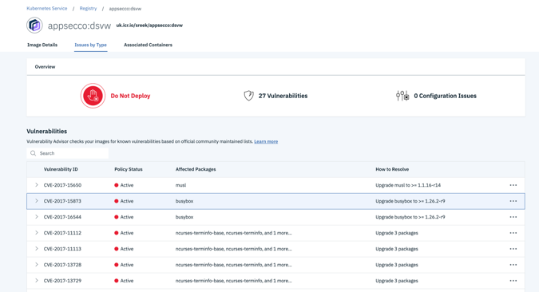

# Security Advisor Lab

# Introduction to the Lab

In this hands-on lab, you will learn how to gain visibility to your resources deployed on cloud.

- You will learn how to use security advisor dashboard to understand your security posture and do drill downs.
- You will learn about pre-integrated findings in Security Advisor
- You will view a demo of Network Insights
- You will view a demo of Partner Integration through wizard (Twistlock)
- Understand Security Advisor Findings API and create a custom card in Security Advisor.

## What you need

For completing this lab, you will need the following / complete these pre-requisites.

1. Laptop – install the IBM Cloud CLI, Install IBM Cloud Kubernetes Service plug-in CLI ,
2. Internet Connectivity
3. IBM Cloud Account – IBM Cloud

Google Chrome or Firefox browser is recommended

# Overview of Tasks
1.	Overview of visibility aspects for Cloud Security
2.	View Pre-integrated findings - Vulnerability Advisor,Certificate Manager  
   i.	Create a certificate expiring shortly and import it into Cert Mgr Instance  
   ii.	Deep dive into the Vulnerability Advisor Finding  
   iii.	Observe the KRI notification on Sec Advisor Dashboard
3.	Network Insightts  
   i.	Inbound threats  
   ii.	Outbound threats  
   iii.	Network Behaviour Analytics
4.	Activity Insights  
   i.	Access Insights  
   ii.	Rules
5.	Parnter Integration  
   i.	Twistlock (Wizard demo / overview)
6. Custom Integration  
   i.	Discuss Security Advisor APIs  
   ii.	Custom Integration (Integrate your own tool)

# Task 1 : Access Security Advisor Dashboard

Security Advisor provides the dashboard to view the security posture of your cloud workloads.  With Security Advisor you can
1.	Access and manage security posture for your cloud workloads from one central dashboard
2.	Discover and monitor security issues and vulnerabilities
3.	Detect suspicious network activity and suspicious access to your IBM Cloud resources

## By using the tile:
1.	Log in to IBM Cloud 
2.	Navigate to the Catalog and click Security and Identity.
3.	Select the Security Advisor tile. A dashboard opens where you can view security information for the preconfigured integrated tools such as vulnerability advisor and certificate manager.

## By using the menu
1.	Log in to IBM Cloud 
2.	From your dashboard, click the hamburger menu to expand your options
3.	Click Security. An overview of the security dashboard opens.
4.	Click Getting Started in the navigation to see general overview information about the service, or click Dashboard if you prefer to learn by seeing the service in action.

Detailed Instructions here - https://cloud.ibm.com/docs/services/security-advisor?topic=security-advisor-getting-started

# Task 2 :  Security Advisor Pre-integrated Findings

## Certificate Manager Findings
IBM Cloud Certificate Manager helps you to store and manage SSL certificates for your IBM cloud-based apps.
Create Certificate Manager Instance 

To get started, create a new Certificate Manager service instance by completing the following steps:
1.	In the IBM Cloud catalog, select Certificate Manager.
2.	Give your service instance a name, or use the pre-set name.
3.	Click Create. ( More details here - https://cloud.ibm.com/docs/services/certificate-manager?topic=certificate-manager-getting-started#getting-started) 

```
Ensure that you select the right region  and resource group
```

Create and Import Certificate

1.	Run the below command to create a SSL certificate expiring in 1 day

`openssl req -x509 -newkey rsa:2048 -keyout key1.pem -subj "/CN=visibilitylab.example.service"  -out visibilitylab.example.service.pem -days 1 -nodes`

2.	Two files will be created  - key1.pem, visibilitylab.example.service.pem
3.	To import your organization's certificates into Certificate Manager, click Import Certificate.

```
If you are not able to create the certificate on your machine,please check with the instructor from where to download the certificate
```

## View alerts on Security Advisor Dashboard

1.	Go to Security Advisor Dashboard following steps in Task 1 : Access Security Advisor Dashboard.
2.	Refresh the dashboard after 1 min. Observe that a Key Risk Indicator appears on the certificate manager card.


3.	Click on View all Findings.  The findings list is shown.


4.	Click on the finding and view the details.


5.	Click on Find your certificate.  This will take you to the Certificate Manager instance. Observe that resource CRN in Security Advisor Finding matches with the Certificate CRN in Certificate Manager.



## Vulnerability Advisor Findings

Vulnerability Advisor provides security management for IBM Cloud Container Registry, generating a security status report that includes suggested fixes and best practices.

### Create Private registry, namespace and import image.

1.	Follow the steps in this link - https://cloud.ibm.com/kubernetes/registry/main/start to setup your private registry and namespace. 

```
You dont need to do this step if there is already a vulnerable image in your registry. Ensure that the region is set correctly before you create the registry and namespace. Follow instructions here https://cloud.ibm.com/docs/services/Registry?topic=registry-registry_setup_cli_namespace 
``` 
2.	Get an image with vulnerabilities. For example,

`docker pull docker pull appsecco/dsvw` 

3.	Tag the image with vulnerabilities. For example,

`docker tag appsecco/dsvw uk.icr.io/<namespace> /appsecco:dsvw` 

4.	Push the image to private registry and namespace. For example,

`docker push uk.icr.io/<namespace>/appsecco:dsvw`

### Observe vulnerability Advisor findings

1.	Go to Security Advisor Dashboard following steps in **Task 1 : Access Security Advisor Dashboard.** 
2.	Refresh the dashboard 
3.	Observe that a Key Risk Indicator appears on the Vulnerability Advisor card




4.	Click on View all Findings.  The findings list is shown.

 

5.	Click on the finding and view the details.

  

6.	Go to Vulnerability Advisor to see the details of the issues and corrective actions.



 

# Task 3 : Security Advisor Network Insights – Demo

* Setup Network Insights
* View Network Insights Cards on Dashboard 

# Task 4 : Security Advisor Activity Insights – Demo

* Pre-requisite for Activity Insights 
Ensure that you have an IBM Cloud Activity Tracker instance in your us-south region

* Setup Activity Insights 
* View Activity Insights Cards on Dashboard


# Task 5 : Partner Integration Demo  

(Twistlock)

# Task 6 : Integrate your own security tool with Security Advisor

- Pre-requisites
- Register a new finding type
- Post a custom finding
- Define the card to display custom findings

# References
•	IBM Cloud Security Advisor - https://cloud.ibm.com/docs/services/security-advisor?topic=security-advisor-index#index  
•	IBM Cloud Activity Tracker with LogDNA - https://cloud.ibm.com/docs/services/Activity-Tracker-with-LogDNA?topic=logdnaat-getting-started#getting-started  
•	IBM Kubernetes Service - https://cloud.ibm.com/docs/containers?topic=containers-container_index#container_index   
•	IBM Kubernetes Service  Solution tutorials - https://cloud.ibm.com/docs/tutorials?topic=solution-tutorials-scalable-webapp-kubernetes#scalable-webapp-kubernetes  
